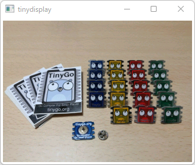
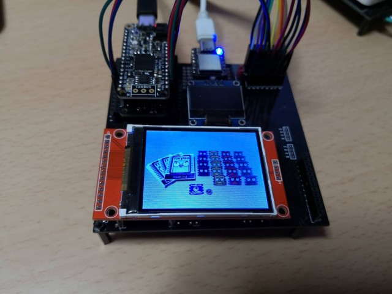

[](https://circleci.com/gh/sago35/go-tjpgd/tree/main)

# go-tjpgd

`go-tjpgd` is the go-binding of TJpgDec.  
TJpgDec is as follows according to its official website.  

> TJpgDec is a generic JPEG image decompressor module that highly optimized for small embedded systems. It works with very low memory consumption, so that it can be incorporated into tiny microcontrollers, such as AVR, 8051, PIC, Z80, Cortex-M0 and etc.

## Usage

First, set the callback.  

```go
tjpgd.SetCallback(func(left, top, right, bottom uint16, buf []uint16) {
	w := int16(right - left + 1)
	h := int16(bottom - top + 1)
	display.DrawRGBBitmap(int16(left), int16(top), buf, w, h)
})
```

It is then decoded by calling `DecodeFromBytes()`.  

```go
b = []byte(img1)

tjpgd.DecodeFromBytes(b, tjpgd.ScaleNone)

tjpgd.DecodeFromBytes(b, tjpgd.ScaleHalf)

tjpgd.DecodeFromBytes(b, tjpgd.ScaleQuarter)
```

### Examples

[./examples](./examples) will work with both tinydisplay and wioterminal.  

#### standard Go



If running with standard Go, launch tinydisplay first.  

```
$ go install github.com/sago35/tinydisplay/cmd/tinydisplay@latest

$ tinydisplay
```

Then do the following.  

```
$ go run ./examples/slideshow
```

#### baremetal



If you want to run it using a target such as wioterminal, please run `tinygo flash`.  

```
$ tinygo flash --target wioterminal --size short ./examples/slideshow

$ tinygo flash --target feather-m4-can --size short ./examples/slideshow
```

## TJpgDec - Tiny JPEG Decompressor

* http://elm-chan.org/fsw/tjpgd/00index.html

## Author

sago35 - <sago35@gmail.com>
